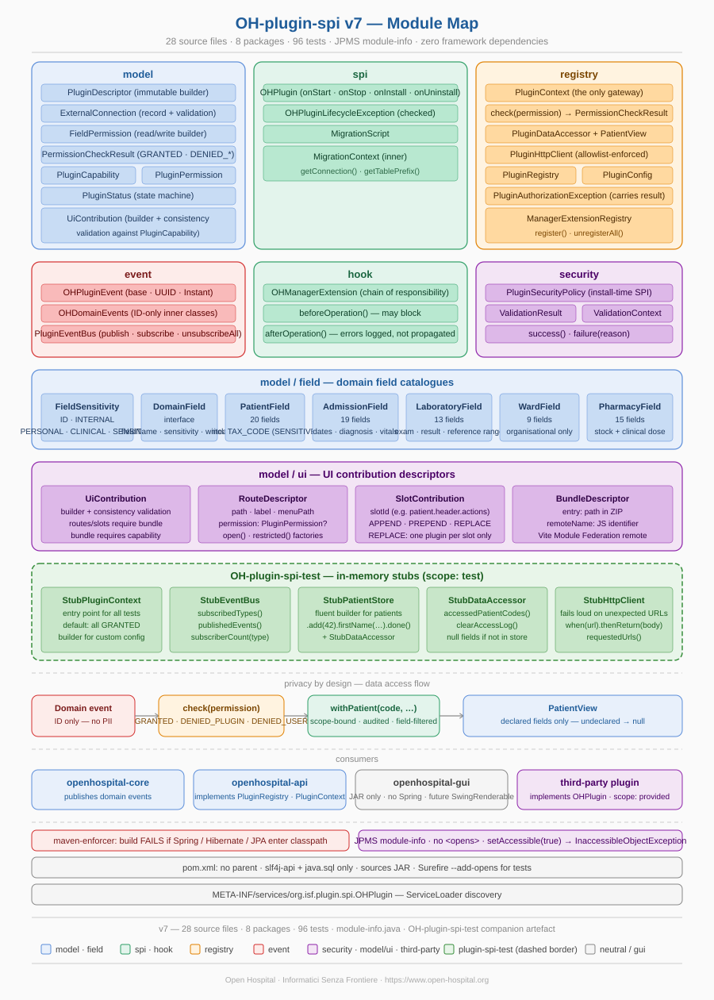

# OH-plugin-spi

Service Provider Interface for Open Hospital plugins.

This module defines the public contract between the Open Hospital runtime and
any third-party plugin. It is a single JAR with **zero framework dependencies**
— only Java 17 and the SLF4J API — that defines everything a plugin can do,
declare, and request.

---

## Contents

- [Architecture overview](#architecture-overview)
- [Quick start](#quick-start)
- [Generating manifest.json](#generating-manifest-json)
- [Package reference](#package-reference)
- [Permission system](#permission-system)
- [Privacy by design](#privacy-by-design)
- [Filesystem access](#filesystem-access)
- [UI contributions](#ui-contributions)
- [Security guarantees](#security-guarantees)
- [Testing your plugin](#testing-your-plugin)
- [Integration into Open Hospital](#integration-into-open-hospital)
- [Build order](#build-order)
- [Version history](#version-history)

---

## Architecture overview



```
openhospital-core          publishes domain events
openhospital-api           implements PluginRegistry and PluginContext
openhospital-gui           includes the SPI JAR (no Spring)
third-party plugin         implements OHPlugin, declared via ServiceLoader
```

The SPI is the only dependency between a third-party plugin and OH. A plugin
compiled against `spi:1.0.0` works on any OH release that supports that SPI
version, regardless of internal Spring or Hibernate upgrades.

The ecosystem consists of four related modules:

| Module | Purpose |
|--------|---------|
| `OH-plugin-spi` | The public contract — interfaces, value objects, enums |
| `OH-plugin-spi-test` | In-memory stubs for unit testing plugins |
| `plugin-maven-plugin` | `generate-manifest` goal — produces `manifest.json` from code |
| your plugin | Implements `OHPlugin`, uses the above |

---

## Quick start

### 1. Add the dependencies

```xml
<!-- Runtime dependency — OH provides it at runtime -->
<dependency>
    <groupId>org.isf</groupId>
    <artifactId>OH-plugin-spi</artifactId>
    <version>1.0.0</version>
    <scope>provided</scope>
</dependency>

<!-- Test utilities — only in test scope -->
<dependency>
    <groupId>org.isf</groupId>
    <artifactId>OH-plugin-spi-test</artifactId>
    <version>1.0.0</version>
    <scope>test</scope>
</dependency>
```

### 2. Implement OHPlugin

```java
public class MyPlugin implements OHPlugin {

    private static final PluginDescriptor DESCRIPTOR = PluginDescriptor.builder()
        .pluginId("com.example.myplugin")        // reverse-domain, no hyphens
        .version("1.0.0")                         // semver
        .name("My Plugin")
        .entryPoint("com.example.myplugin.MyPlugin")
        .minCoreVersion("1.15.0")
        .capabilities(List.of(PluginCapability.EVENT_LISTENER))
        .fieldPermissions(List.of(
            FieldPermission.read(PatientField.FIRST_NAME, PatientField.LAST_NAME)
                           .purpose("Log new patient registrations")))
        .build();

    @Override
    public PluginDescriptor getDescriptor() { return DESCRIPTOR; }

    @Override
    public void onStart(PluginContext ctx) throws OHPluginLifecycleException {
        ctx.eventBus().subscribe(
            OHDomainEvents.PatientCreated.class,
            event -> ctx.data().withPatient(
                event.getPatientCode(),
                view -> ctx.logger().info("New patient: {} {}",
                    view.getFirstName(), view.getLastName())));
    }
}
```

The `DESCRIPTOR` is the single source of truth. `manifest.json` is generated
from it automatically — see [Generating manifest.json](#generating-manifest-json).

### 3. Register via ServiceLoader

Create `src/main/resources/META-INF/services/org.isf.plugin.spi.OHPlugin`:

```
com.example.myplugin.MyPlugin
```

### 4. Package structure

```
myplugin-1.0.0.jar          (produced by mvn package -P package-plugin)
├── META-INF/services/org.isf.plugin.spi.OHPlugin
├── manifest.json            (generated automatically — do not edit by hand)
└── com/example/myplugin/
    └── MyPlugin.class
```

---

## Generating manifest.json

`manifest.json` is generated automatically by the `plugin-maven-plugin` during
`mvn package`. You never write or edit it by hand.

### Setup

First install the maven plugin locally (once, after cloning the repository):

```bash
cd openhospital-core/plugin-spi       && mvn clean install
cd ../plugin-spi-test                  && mvn clean install
cd ../plugin-maven-plugin              && mvn clean install
```

Then add the plugin to your plugin's `pom.xml` inside a profile:

```xml
<profiles>
  <profile>
    <id>package-plugin</id>
    <build>
      <plugins>
        <plugin>
          <groupId>org.isf</groupId>
          <artifactId>plugin-maven-plugin</artifactId>
          <version>1.0.0</version>
          <executions>
            <execution>
              <goals><goal>generate-manifest</goal></goals>
            </execution>
          </executions>
        </plugin>
      </plugins>
    </build>
  </profile>
</profiles>
```

### Generate

```bash
mvn clean package -P package-plugin
```

The manifest is written to `target/classes/manifest.json` and included in the
JAR automatically. Verify with:

```bash
jar tf target/myplugin-1.0.0.jar | grep manifest
```

### How it works

The Mojo instantiates your `OHPlugin` class via reflection, calls
`getDescriptor()`, and serialises the result to pretty-printed JSON using
Jackson. The SPI itself has no JSON dependency — serialisation lives entirely
in the Mojo. Your class must have a public no-argument constructor and
`getDescriptor()` must not require any injected state.

### Skip manifest generation

To skip in CI pipelines that only run tests:

```bash
mvn clean verify -Dplugin.skipManifest=true
```

---

## Package reference

| Package | Key types | Responsibility |
|---------|-----------|----------------|
| `model` | `PluginDescriptor`, `FieldPermission`, `PermissionCheckResult`, `ExternalConnection` | Value objects describing a plugin's identity, capabilities, and data access |
| `model.field` | `DomainField`, `FieldSensitivity`, `PatientField`, `AdmissionField`, `LaboratoryField`, `WardField`, `PharmacyField` | Domain field catalogues with privacy sensitivity metadata |
| `model.ui` | `UiContribution`, `RouteDescriptor`, `SlotContribution`, `BundleDescriptor` | Descriptors for React UI contributions |
| `spi` | `OHPlugin`, `MigrationScript`, `OHPluginLifecycleException` | Primary lifecycle interfaces |
| `registry` | `PluginContext`, `PluginDataAccessor`, `PatientView`, `PluginHttpClient`, `PluginFileAccess` | Runtime gateway — the only contact point between a plugin and OH |
| `event` | `OHDomainEvents`, `OHPluginEvent`, `PluginEventBus` | ID-only domain events |
| `hook` | `OHManagerExtension` | Chain-of-responsibility extension point for OH-core Managers |
| `security` | `PluginSecurityPolicy`, `ValidationResult` | Install-time security policy SPI |

---

## Permission system

Authorization uses two complementary mechanisms.

### Field-level permissions

Instead of declaring `READ_PATIENT`, a plugin declares exactly which fields it
needs and why:

```java
FieldPermission.read(
    PatientField.FIRST_NAME,
    PatientField.LAST_NAME,
    PatientField.BIRTH_DATE)
  .purpose("Display patient header on radiology report")
```

Each `DomainField` carries `fieldName()`, `sensitivity()`, and `writeable()`.
The type system prevents mixing fields from different domains in the same
`FieldPermission` — a compile error, not a runtime one.

**Sensitivity levels:**

| Level | Meaning | GDPR |
|-------|---------|------|
| `ID` | Opaque system identifier | Not personal data |
| `INTERNAL` | Organisational code | Not personal data |
| `PERSONAL` | Identifies a person in society | Art. 4 |
| `CLINICAL` | Describes a person as a patient | Art. 9 |
| `SENSITIVE` | Universal identifier or socially stigmatised data (e.g. `TAX_CODE`) | Art. 9 + explicit admin approval |

### Three-state permission check

```java
return switch (ctx.check(PluginPermission.READ_PATIENT)) {
    case GRANTED       -> ResponseEntity.ok(loadData(patientCode));
    case DENIED_PLUGIN -> ResponseEntity.status(403)
                             .body("Plugin not configured for patient access");
    case DENIED_USER   -> ResponseEntity.status(403)
                             .body("Your role does not allow reading patient data");
};
```

Or as a guard clause:

```java
if (ctx.check(READ_PATIENT).isDenied()) {
    return ResponseEntity.status(403).build();
}
```

`DENIED_PLUGIN` — the plugin lacks the permission (not declared or not approved).
`DENIED_USER` — the plugin has the permission but the current user lacks the OH role.

---

## Privacy by design

### ID-only events

All `OHDomainEvents` carry only opaque identifiers — never PII or clinical data.
`PatientCreated` carries only `patientCode`. To access patient data the plugin
must call `ctx.data().withPatient(...)`, which requires a declared `FieldPermission`
and writes an audit entry.

### Scope-bound data access

The `PatientView` passed to `withPatient()` is valid only inside that call.
This prevents the plugin from caching patient data outside the request scope.

### Network allowlist

Every outbound connection must be declared in the descriptor as an
`ExternalConnection`. The `PluginClassLoader` (in `api`) blocks any connection
to an undeclared host at runtime.

```java
new ExternalConnection("pacs.hospital.org", 11112, "DICOM",
    "Send DICOM study to hospital PACS", Direction.OUTBOUND)
```

---

## Filesystem access

A plugin that writes log files declares `LOG_FILE_WRITE` and uses `ctx.files()`:

```java
.capabilities(List.of(PluginCapability.EVENT_LISTENER, PluginCapability.LOG_FILE_WRITE))
```

```java
try (Writer w = ctx.files().openLogWriter("audit.log", true)) {
    w.write("[2024-01-15 10:23] CREATED - Mario Rossi (code: 42)\n");
}
```

The plugin only sees relative paths inside its sandbox directory, configured
in `settings.properties` via `plugin.log.dir`. Path traversal attempts
(e.g. `../other-plugin/secret.log`) are rejected with `IllegalArgumentException`.

Calling `ctx.files()` without the `LOG_FILE_WRITE` capability throws
`UnsupportedOperationException`.

---

## UI contributions

Plugins that contribute to the React UI declare a `UiContribution` block:

```java
UiContribution.builder()
    .bundle("ui/radiology.js", "radiologyPlugin")
    .route(RouteDescriptor.open("/radiology", "Radiology", "Modules.Radiology"))
    .slot(new SlotContribution("patient.header.actions", SlotMode.APPEND))
    .build()
```

`RouteDescriptor` — declares a new page. The optional `permission` field uses
`PluginPermission`, not OH role names. OH-ui currently performs authentication-only
routing; permission-aware routing is planned for Phase 4.

`SlotContribution` — injects a component into a named `<PluginSlot>`. Mode
`REPLACE` is exclusive — only one plugin may replace a given slot.

`BundleDescriptor` — locates the JS bundle in the JAR and specifies the Module
Federation `remoteName` (must be a valid JS identifier, no hyphens).

`PluginDescriptor.build()` validates consistency between declared capabilities
and `UiContribution` content — mismatches cause an `IllegalArgumentException`.

---

## Security guarantees

**Maven enforcer** — the build fails if Spring, Hibernate, or JPA enter the
compile classpath. Executable documentation against accidental framework leakage.

**JPMS encapsulation** — `module-info.java` exports all public packages but
opens none. `setAccessible(true)` on any class in this module throws
`InaccessibleObjectException` at runtime. A plugin cannot bypass `PluginContext`
to reach the Spring `ApplicationContext` via reflection.

**Install-time security policies** — `PluginSecurityPolicy` allows
`openhospital-api` to register policies applied before any plugin is activated.
Planned implementations: GPG signature, SHA-256 checksum, capability allowlist,
semver compatibility, dependency resolution.

---

## Testing your plugin

Add the test utilities artefact (see `OH-plugin-spi-test` README for the full
stub API reference):

```xml
<dependency>
    <groupId>org.isf</groupId>
    <artifactId>OH-plugin-spi-test</artifactId>
    <version>1.0.0</version>
    <scope>test</scope>
</dependency>
```

Use `StubPluginContext` — no Spring, no database, no filesystem:

```java
@BeforeEach
void setUp() throws Exception {
    ctx = StubPluginContext.builder()
            .capabilities(List.of(PluginCapability.EVENT_LISTENER))
            .build();
    ctx.patientStore()
       .add(42).firstName("Mario").lastName("Rossi").done();
    plugin = new MyPlugin();
    plugin.onStart(ctx);
}

@Test
void pluginSubscribesToPatientEvents() {
    assertThat(ctx.eventBus().subscribedTypes())
            .contains(OHDomainEvents.PatientCreated.class);
}

@Test
void pluginReactsToPatientCreated() {
    ctx.eventBus().publish(new OHDomainEvents.PatientCreated(42));
    assertThat(ctx.data().accessedPatientCodes()).containsExactly(42);
}
```

For plugins that write log files, use `StubFileAccess`:

```java
ctx = StubPluginContext.builder()
        .capabilities(List.of(
                PluginCapability.EVENT_LISTENER,
                PluginCapability.LOG_FILE_WRITE))
        .build();
// ...
ctx.eventBus().publish(new OHDomainEvents.PatientCreated(42));
assertThat(ctx.files().writtenTo("audit.log")).contains("Mario Rossi");
```

---

## Integration into Open Hospital

All four modules live inside `openhospital-core` as submodules:

```
openhospital-core/
├── pom.xml                      (lists all four modules)
├── plugin-spi/
├── plugin-spi-test/
├── plugin-maven-plugin/
└── src/                         (openhospital-core own sources)
```

Add to `openhospital-core/pom.xml`:

```xml
<modules>
    <module>plugin-spi</module>
    <module>plugin-spi-test</module>
    <module>plugin-maven-plugin</module>
</modules>
```

Dependencies in sibling modules:

```xml
<!-- openhospital-core, openhospital-api, openhospital-gui -->
<dependency>
    <groupId>org.isf</groupId>
    <artifactId>OH-plugin-spi</artifactId>
    <version>1.0.0</version>
</dependency>
```

**Eclipse:** File → Import → Maven → Existing Maven Projects → select each
submodule folder individually.

---

## Build order

### First setup (once after cloning)

```bash
cd openhospital-core/plugin-spi       && mvn clean install
cd ../plugin-spi-test                  && mvn clean install
cd ../plugin-maven-plugin              && mvn clean install
cd ../..                               && mvn clean install
```

### Developing a plugin

```bash
# run tests only
cd my-plugin && mvn clean test

# build JAR with generated manifest.json
cd my-plugin && mvn clean package -P package-plugin

# force re-resolution after first failed attempt
cd my-plugin && mvn clean package -P package-plugin -U
```

### Verify JAR contains manifest

```bash
jar tf target/myplugin-1.0.0.jar | grep manifest
# should print: manifest.json
```

Requirements: Java 17+, Maven 3.8+.

---

## Version history

| Version | Changes |
|---------|---------|
| v1 | Core SPI — `OHPlugin`, `PluginContext`, events, hooks, security |
| v2 | Bug fixes — FQCN pattern, Eclipse project files |
| v3 | Privacy by design — `ExternalConnection`, ID-only events, `PluginDataAccessor` |
| v4 | Field-level permissions — `FieldPermission`, domain field enums |
| v5 | JPMS `module-info.java`, Surefire `--add-opens`, import cleanup |
| v6 | Three-state `PermissionCheckResult`, single `check()` method |
| v7 | UI contributions — `UiContribution`, `RouteDescriptor`, `SlotContribution`, `BundleDescriptor` |
| v8 | `PluginFileAccess` + `LOG_FILE_WRITE`, `getDescriptor()` on `OHPlugin`, `plugin-maven-plugin` with `generate-manifest` goal using Jackson — `toJson()` moved out of SPI into Mojo |
